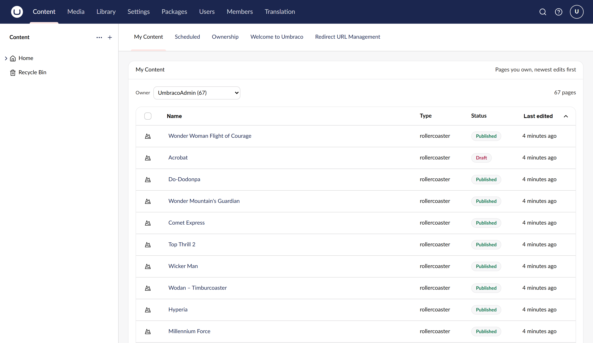
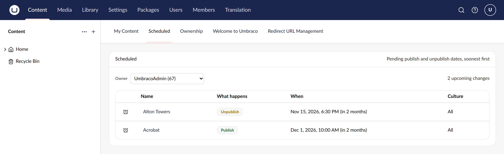
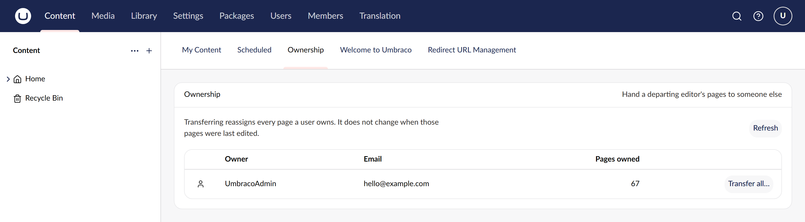

# Content Dashboard for Umbraco

**Who is responsible for which pages, and what is about to change.**

[](https://www.nuget.org/packages/Our.Umbraco.ContentDashboard)
[](https://github.com/SteveVaneeckhout/Our.Umbraco.ContentDashboard)

Three tabs in the Content section: every page you own with its status and age, your pending
publish and unpublish dates, and an administrators-only hand-over of everything a departing editor
owned. Ownership is Umbraco's own creator field, so it shows up in the standard UI — and transfers
deliberately do not stamp the last-edited date.

```bash
dotnet add package Our.Umbraco.ContentDashboard
```

Requires Umbraco 18 and .NET 10. On the **Umbraco 17 LTS**, install the 17.x line instead - the
package major follows the Umbraco major:

```bash
dotnet add package Our.Umbraco.ContentDashboard --version "17.*"
```







## Documentation

- [Development setup](development.md)
- [How it works](architecture.md)
- [Full README](https://github.com/SteveVaneeckhout/Our.Umbraco.ContentDashboard#readme)
- [Changelog](https://github.com/SteveVaneeckhout/Our.Umbraco.ContentDashboard/blob/main/CHANGELOG.md)
- [Report an issue](https://github.com/SteveVaneeckhout/Our.Umbraco.ContentDashboard/issues)

---

MIT licensed. Part of a set of three Umbraco 18 packages:
**Content Dashboard for Umbraco** (this one) · [Error Dashboard for Umbraco](https://github.com/SteveVaneeckhout/Our.Umbraco.ErrorDashboard) · [TrueCopy for Umbraco](https://github.com/SteveVaneeckhout/Our.Umbraco.TrueCopy)
